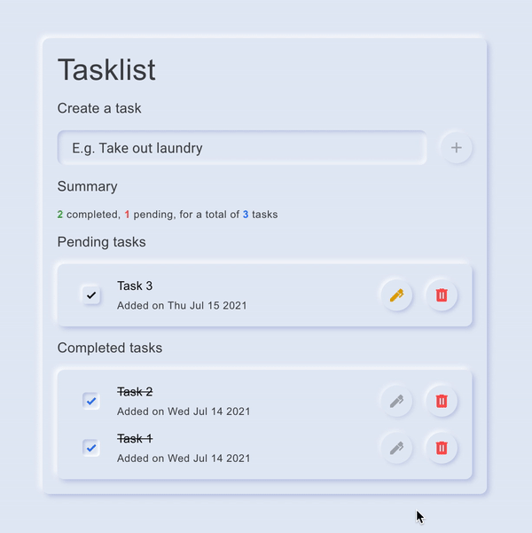

<p align="center">
  
</p>

# 8Base Tasklist

A simple task list bootstraped with [`create-react-app`](https://github.com/facebook/create-react-app) and connecting to the [8Base](https://www.8base.com/) API for storage & serverless functions.

## Features

This project includes:

- A modern UI based on the [neumorphic principles](https://www.justinmind.com/blog/neumorphism-ui/) (using the [`ui-neumorphism`](https://akaspanion.github.io/ui-neumorphism/) component library).
- Pre-made unit tests with [Jest](https://jestjs.io/) & [React Testing Library](react-testing-library).
- Pre-configured end-to-end tests with [Cypress](https://www.cypress.io/).

<p align="center">
  
</p>

## Usage

First, clone the repo:

```sh
$ git clone https://github.com/gantoreno/8base-tasklist
$ cd 8base-tasklost
```

Then, install the dependencies with [`yarn`](https://yarnpkg.com/):

```sh
$ yarn
```

Finally, run the app with `yarn start`:

```sh
$ yarn start
```

The app should be up and running in [http://localhost:3000](http://localhost:3000).

## Testing

To run unit tests:

```sh
$ yarn run test
```

To run end-to-end tests:

```sh
$ yarn run cypress:open
```

After that, use the Cypress GUI to trigger a test run.
